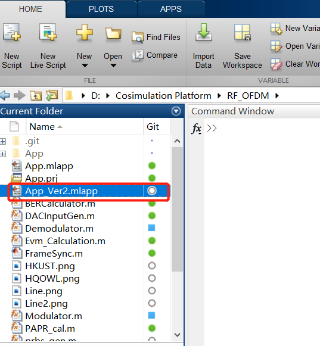

# HKUST OWL Mixed-Mode Co-simulation Platform
Supervised by Professor C. Patrick Yue, we developed this co-simulation platform for high frequency RF and mm-Wave transceiver systems dealing with complex modulated signals

## 1. Motivation
Traditionally, a continuous-wave (CW) signal is used to evaluate and simulate RF and millimeter-wave (mm-wave) circuits during the design procedure, while fabricated circuits are measured by modulated signals in the test phase, because complex modulated signals are used in reality. It is almost impossible to use a CW signal to predict system performance, such as error vector magnitude (EVM), bit error rate (BER), etc., of RF and mm-wave circuits when dealing with complex modulated signals. This platform, combining Matlab, ADS, Cadence and EMX simulators, is used for RF and mm-Wave transceiver system dealing with complex modulated signals. MATLAB is used to simlulate the baseband part of the system. The signal with both single or multi subcarries can be generated by the MATLAB code with adjustable parameters. The generated signal can be transmitted to ADS or cadence as the input of the frontend circuit. Then the simulation result from ADS or cadence is returned to MATLAB again for decoding and demodulation. The constellation, signal spectrum and waveform in time domain from both transmitter and receiver can be obtained. And the PAPR, BER, EVM can be calculated automatically by the simulator. The structure and the usage of the simulator is shown below.

## 2. Enviroment Requirment
* MATLAB 2019b or newer version
* ADS2019 or newer version
* Cadence

## 3. Co-simulation Flow
The co-simulation flow is summarized and is shown in the following figure. The ENVELOPE controller offering a fast and complete analysis of digitally modulated RF signals, therefore the simulation of the transceiver system in Step (3) should use the ENVELOPE controller in ADS. The data flow (DF) and ENVELOPE controllers should be utilized simultaneously when performing co-simulation in ADS. 

The following link shows a co-simulation demon video. 
https://www.dropbox.com/s/yozp1s3v05lhn6p/Cosimulation_Platform_Demo.mp4?dl=0

## 4. Tutorial for the Co-Simulation Platform
The following steps show a cosimulation example step-by-step. 

Step 1. Download the all files. Put 'RF_OFDM', 'Matlab_ADS_Data' and 'Cosimulation_TRx_wrk' folders into the same loacation.

Step 2. Open Matlab 2019a (or later). Go to ‘RF_OFDM’ folder, Select and run ‘App_Ver2.mlapp’. 

Step 3. Setup the GUI accroding to your requirements, such as number of subcarriers, modulation order, etc. And then click the 'Signal Modulation' icon. After the signal modulation is finished, the normalized power spectrum density (PSD), constellation and time domain waveform (real part) of the BB M-QAM OFDM signal are all displayed on the GUI (left part on the GUI). The following figure (left part) shows an exampple.

Step 4. Use ADS2019 or latter to open the workspace named 'Cosimulation_TRx_wrk'. And select and open ‘System_TEST’ schematic. The ADS simulation schematic is as follow. 

After completing the simulation in schematic, the results will appear as shown below.

Step 5. Go back to the GUI and click "Signal Modulation" button. Wait for a second, the spectrum, constellation and waveform of the transmitted signal are shown in the window, as shown in the figure (right part) in Step 3. 
 
Step 6. Now you can replace your own design to the example project for the Co-Simulation!

For more information, please contact us at: eewmshi@ust.hk
